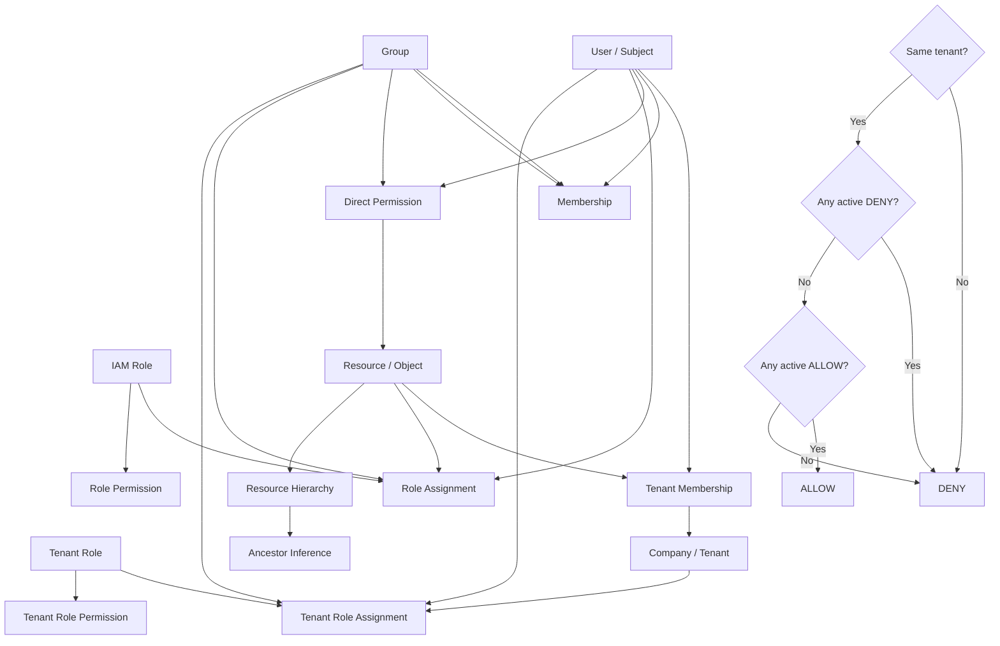
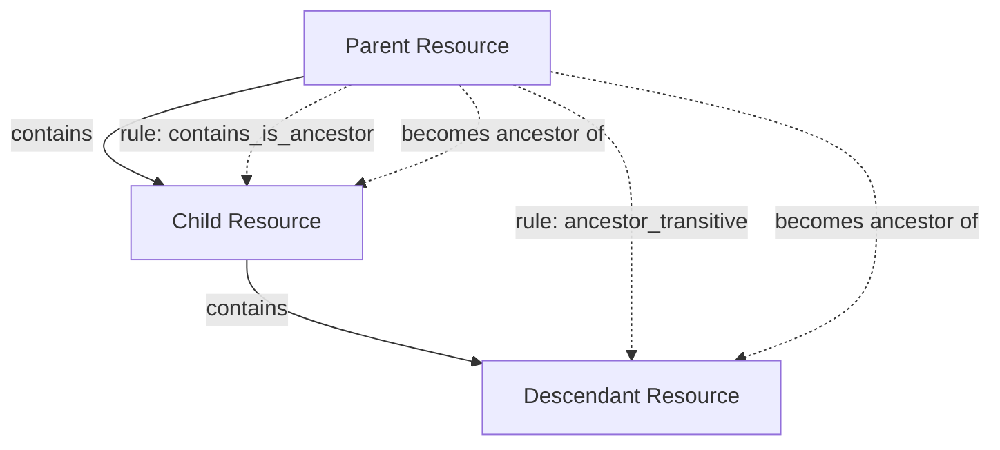

# Business Server

A Rust-based business application server using TypeDB for data persistence.

## Environment Variables

### Required Variables

- `HTTP_HOST` - Host address for the HTTP server
- `HTTP_PORT` - Port number for the HTTP server
- `TYPEDB_ADDR` - TypeDB server address
- `TYPEDB_DB` - TypeDB database name
- `TYPEDB_USERNAME` - TypeDB username
- `TYPEDB_PASSWORD` - TypeDB password

### Optional Variables

- `TYPEDB_TLS` - Enable TLS for TypeDB connection (default: "false")
- `ENVIRONMENT` - Application environment (default: "development")
- `TYPEDB_FORCE_RECREATE` - Force database recreation (default: "false")
- `AUTH_JWT_SECRET` - JWT secret for authentication (default: "dev-secret")
- `AUTH_SERVICE` - Authentication service name (default: "accounts")
- `AUTH_ENTITY` - Authentication entity type (default: "user")
- `SUPER_COMPANY` - Super company identifier (default: "JITPOMI")

## Database Behavior

The server implements environment-aware database management:

- **Development mode** (`ENVIRONMENT=development`): Database is recreated on each restart for clean state
- **Production mode** (`ENVIRONMENT=production`): Existing database is preserved, only creates if missing
- **Force recreation**: Set `TYPEDB_FORCE_RECREATE=true` to force database recreation regardless of environment

This ensures data persistence in production while allowing clean development cycles.

## IAM Model



```mermaid
flowchart TD
    START([Access Request: subject, object, action, now])

    START --> ST[Check same_tenant(subject, object)]
    ST --> STQ{Same tenant?}

    STQ -->|No| DENY1[DENY]
    STQ -->|Yes| HD[Check has_deny_inherited]

    HD --> D1[Direct deny permission?]
    HD --> D2[Group deny permission?]
    HD --> D3[Role deny permission?]
    HD --> D4[Inherited deny from ancestor?]
    HD --> D5[Inherited group deny?]
    HD --> D6[Inherited role deny?]

    D1 --> DQ{Any deny found?}
    D2 --> DQ
    D3 --> DQ
    D4 --> DQ
    D5 --> DQ
    D6 --> DQ

    DQ -->|Yes| DENY2[DENY]
    DQ -->|No| HA[Check has_allow_inherited]

    HA --> A1[Direct allow permission?]
    HA --> A2[Group allow permission?]
    HA --> A3[Role allow permission?]
    HA --> A4[Inherited allow from ancestor?]
    HA --> A5[Inherited group allow?]
    HA --> A6[Inherited role allow?]

    A1 --> AQ{Any allow found?}
    A2 --> AQ
    A3 --> AQ
    A4 --> AQ
    A5 --> AQ
    A6 --> AQ

    AQ -->|Yes| ALLOW[ALLOW]
    AQ -->|No| DENY3[DENY]
```


